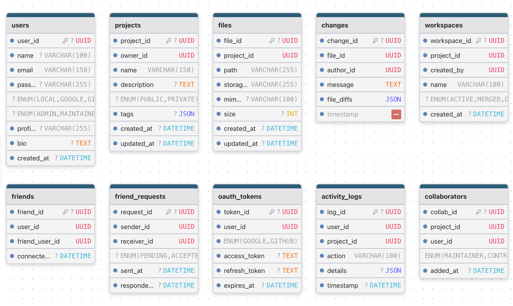

# 💡 OpenBox – Lightweight Project & CRUD Operation Handler  
**Team Name:** Dev4ce  

---

## 📄 1. Project Overview

Managing small-to-medium development projects often requires a simple, reliable system to store, edit, and track project files and metadata without the full complexity of a distributed VCS.  
**OpenBox** is a lightweight web application that focuses on CRUD-based project handling: create repositories (projects), upload/manage files, edit in-browser, track commits/changes as records (not a full Git model), and handle collaboration via roles and auth.

OpenBox is designed to be a simple, extensible platform for teams, students, and solo developers who want a neat self-hosted project manager with easy file operations, history tracking, and integrations (OAuth + JWT).

---

## ⚙️ 2. Key Features

- **Project Management (CRUD):** Create, read, update, and delete projects and project files.  
- **File Upload & In-browser Editing:** Upload files and edit them using an integrated editor (Monaco/CodeMirror).  
- **Change Records:** Save change entries (message, timestamp, diff metadata) — lightweight commit-like history without Git internals.  
- **Authentication:** JWT for token-based auth + OAuth (Google/GitHub) sign-in for convenience.  
- **Role-Based Access:** Admin, Maintainer, Contributor, and Viewer roles with permissions.  
- **Branch-like Workflows (Lightweight):** Create ephemeral workspaces for testing edits before applying to the main project.  
- **Search & Filter:** Find projects/files by name, language, tags, or owner.  
- **Activity Log & Audit:** Track create/update/delete operations for accountability.  
- **Notifications:** Optional in-app notifications for mentions, share requests, or new change records.  
- **Export / Import:** Download project snapshots or import zipped projects.

---

## 👥 3. User Roles

### 🧑‍💻 Contributor / Developer
- Create and edit projects they own or have access to.  
- Upload files and create change records.

### 👨‍🔧 Maintainer
- Manage collaborators for specific projects.  
- Approve/merge changes from contributor workspaces.

### 🧑‍💼 Admin
- Full access across the platform.  
- Manage users, global settings, and system logs.

### 👩‍💼 Viewer / Auditor
- Read-only access to specified projects and activity logs.

---

## 🖥️ 4. Frontend Pages / Screens

| Page | Description |
|------|--------------|
| **Landing Page** | Product intro, OAuth sign-in CTA, links to docs |
| **Login / Signup** | JWT authentication + OAuth (Google / GitHub / etc.) |
| **Dashboard** | User projects, recent activity, quick actions |
| **Create Project** | Create new project (metadata: description, visibility, tags) |
| **Project View** | File tree, change records, collaborators, settings |
| **File Editor** | Edit files inline, preview, save as new change record |
| **Change History** | Chronological list of change records with diffs |
| **Collaborators** | Invite/assign roles via email or OAuth identity |
| **Admin Panel** | User management, system logs, platform settings |
| **Activity Log** | Global and project-scoped audit trail |

---

## 🗃️ 5. Database Design (MongoDB **or** MySQL)

> The platform supports either **MongoDB** (document-first flexibility) **or** **MySQL** (relational guarantees). Choose based on deployment preferences.

| Collection / Table | Description |
|--------------------|-------------|
| **users** | User profiles, OAuth identities, hashed credentials, roles |
| **projects** | Project metadata (name, description, owner, visibility, tags) |
| **files** | File metadata (path, project_id, size, mime_type, storage_ref) |
| **changes** | Lightweight change records (message, author_id, timestamp, file_diffs) |
| **workspaces** | Ephemeral branches/workspaces for tentative edits |
| **collaborators** | Project access control list (user_id, role) |
| **activity_logs** | Audit trail of actions (create, update, delete, share) |
| **oauth_tokens** | Encrypted OAuth tokens (refresh/access) if needed for integrations |

---

## 🧩 6. Entity-Relationship (ER) Diagram

Below is the complete **ER Diagram** representing the OpenBox database schema and relationships between entities.

  

> 💡 The ER diagram illustrates all major entities — users, projects, files, changes, workspaces, collaborators, activity logs, and OAuth tokens — along with their relationships (1–N, N–M).

---

## 🧰 7. Tech Stack

| Layer | Technology |
|--------|-------------|
| **Frontend** | Next.js (recommended) or React + Tailwind CSS |
| **Backend** | Node.js + Express.js or Next.js API routes |
| **Database** | **MongoDB (Atlas)** **or** **MySQL** |
| **Authentication** | **JWT** (stateless API tokens) + **OAuth** (Google, GitHub) |
| **Storage** | Cloud object storage (S3-compatible) for files & snapshots |
| **Editor** | Monaco Editor or CodeMirror for in-browser editing |
| **Diffing** | jsdiff / diff-match-patch for storing change metadata |
| **Deployment** | Docker + cloud provider (VPS / DigitalOcean / AWS) |
| **Optional** | Redis for sessions/queues, workers for background tasks |

---

## 🔄 8. Workflow

1. User signs in via OAuth or registers and authenticates using JWT.  
2. Dashboard lists user-owned and shared projects.  
3. User creates a project (CRUD) and uploads files or creates them in-editor.  
4. Saving changes creates a **change record** with metadata (author, message, timestamp, diffs).  
5. Contributors can create a workspace (ephemeral) to stage edits; maintainers review and apply to the main project.  
6. Activity logs capture every create/update/delete for auditing.  
7. Admin controls and global settings manage platform-wide policies and integrations.

---

## 🎯 9. Expected Outcomes

- A polished CRUD-based project handling app (OpenBox) for teams and individuals.  
- Secure auth with both JWT tokens and OAuth sign-in options.  
- Flexible DB support: MongoDB **or** MySQL depending on user needs.  
- In-browser file editing with lightweight history (change records).  
- Clean UI with role-based features and robust activity auditing.  
- Easy deployment path with Docker and cloud storage.

---

## 🚀 10. Future Enhancements

- Real-time collaboration (operational transforms or CRDT) for simultaneous editing.  
- Integrations: CI runners, code linters, and webhooks.  
- Native mobile app or PWA.  
- Advanced RBAC and SSO (enterprise).  
- Optional Git integration/adapter for sync to real Git repos.  
- AI-assisted code reviews and commit message suggestions.

---

## 👥 Team Members

| Name | Role | Responsibilities |
|------|------|------------------|
| **Yuvraj** | Backend Developer | Handles Authentication Systems |
| **Sumit** | Backend Developer | Database design & management |
| **Oashe** | Backend Developer | AI integrations & APIs Design |
| **Nihal** | Frontend Developer | User interface & experience |

---

> 🧑‍💻 **Team Dev4ce** — building **OpenBox** to make project file management simple, secure, and scalable for modern teams.
